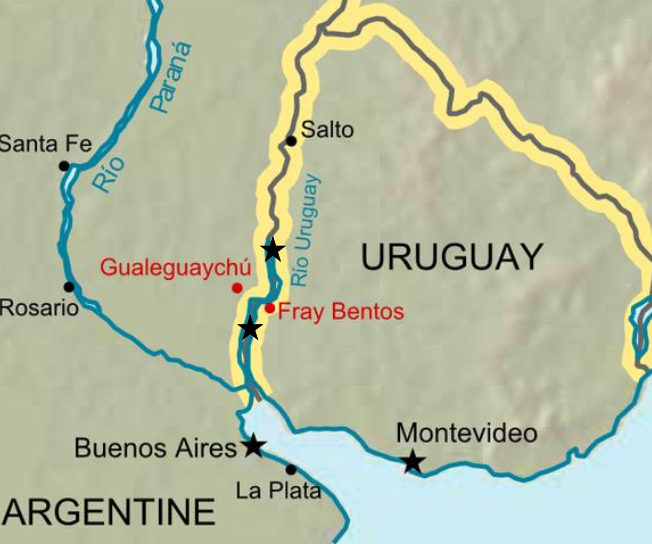

```{r, include =  FALSE}
library(tidyverse)
```

# Aplicación del Análisis de Varianza (ANOVA)

Continuamos con el caso de la planta procesadora de celulosa en Uruguay.
Una vez iniciada las operaciones de la planta, se requiere evaluar el comportamiento de la Demanda Bioquímica de Oxígeno (DBO) a lo largo de los ríos que captan el agua contaminada.
Con este propósito, se ha recomendado que la DBO se mida en cuatro lugares: (1) río arriba (zona carente de contaminación por los efluentes de la planta), (2) en los alrededores de descarga de la planta, (3) en la desembocadura del rió Uruguay sobre el río de la Plata, y (4) en la desembocadura del Río de la Plata sobre el océano Atlántico (Figura 1).



1.  Importa los datos en R, y verifica sus características y estructura. ¿Cuántas dimensiones tiene la tabla que importaste? ¿En qué difiere esta de aquellas usada en las pruebas de *t* para dos muestras?

```{r,  include =  FALSE}
datos <- read.csv("datos.csv")
```

2.  Lleva a cabo una breve exploración gráfica y numérica de los datos que te permita responder a las siguientes preguntas. Para esto usa las funciones `boxplot` y `aggregate`. Este último para calcular las medias y desviaciones estándar de cada localidad con las funciones `mean` y `sd`, respectivamente. Note que no podrá estimar ambos parámteros simultáneamente, por lo que deberá calcularlos separadamente, y luego combinar resultados para tener una sola tabla. Recomiendo que para ambas funciones (`boxplot` y `aggregate`) use el método *S3 method for class 'formula'*. Alternativamente, puede emplear el paquete `dplyr` y las funciones `group_by`y `summarise` para estimar ambos parámteros en simultáneo.

```{r, eval=FALSE}

#Completa los argumentos para la construcción de el gráfico de cajas
boxplot()

#Completa los argumentos para la estimación de promedio y desviación estándar
promedio <- aggregate()
promedio

desv.est <- aggregate()
desv.est

# Combinar ambos resultados en una tabla
tabla1 <-
  data.frame(
    "localidades" = promedio$localidades,
    "DBO" = c(NA, NA, NA, NA),
    "Desv.Est" = c(NA, NA, NA, NA)
  )

tabla1[, 2] <- promedio[, 2]
tabla1[, 3] <- desv.est[, 2]
tabla1

# Alternativa empleando dplyr
library(dplyr)

tabla1 <- datos %>% 
            group_by(localidades) %>% 
            summarise(Desv.Est = sd(DBO), DBO = mean(DBO))

```

Responde a las siguientes preguntas:

a.  ¿Son similares o diferentes los valores promedios de las 4 localidades?
b.  ¿Son similares o diferentes las dispersiones de las 4 localidades?
c.  ¿Cómo es la distribución de la variable de respuesta?
d.  ¿Es esta distribución similar entre los distintos niveles?

```{=html}
<!-- -->
```
2.  Aplica un **ANOVA** a los datos. Para ello se requiere primero obtener un modelo lineal usando la función `lm`. Esta función ajusta un modelo lineal de la variable de respuesta en función de la variable explicativa. Como en este caso la variable explicativa es un factor (categórico), es conveniente hacerlo explícito. Puedes ajustar el modelo usando la *localidad* como variable explicativa. Copia el siguiente comando y analiza la respuesta que R devuelve (PISTA: la primera linea de la respuesta es el modelo).

```{r, results='hide'}


#Especificar que localidades son una variable expicativa (factor)
datos$localidades <- as.factor(datos$localidades)

#Preguntamos si localidades son reconocidas como factor en R
is.factor(datos$localidades)

#Modelo lineal
lm(DBO ~ localidades, data = datos)

```

Responde a las siguientes preguntas:

a. ¿Reconoces alguno de los valores bajo el título de *Coefficients*? ¿Qué crees que son éstos valores?
b. ¿qué representa el primer coeficiente generado por `lm`?

4.  Guarda el modelo que acabas de ajustar bajo un objeto con el nombre *mod1*, y aplica la función `anova` a dicho objeto.

```{r,  include =  FALSE}
mod1 <- lm(DBO ~ localidades, data = datos)
anova(mod1)
```

Responde a las siguientes preguntas: 
a. ¿Qué hace la función `anova`?
b. ¿Qué es la *Sum Sq* correspondiente al factor *localidades* y a los residuales?¿
qué es *Df*?
c. ¿Cuánto vale la *Sum Sq* total?
d. ¿Corresponden los valores de *Sum Sq* y *Df* que aparecen en la consola con aquéllos calculados en la primera parte de la actividad?
e. ¿Qué es la *Mean Sq*?
f. ¿Qué representa el valor de *F* de la tabla? ¿Es un valor grande o pequeño? ¿Cómo lo sabes?
g. ¿Qué representa el valor de probabilidad? ¿Es un valor grande o pequeño? ¿Cómo lo sabes?
h. Calcula la proporción de la variación total de la variable *DBO* que es debida al factor *localidades*.
i. ¿Es grande o pequeña esta proporción? ¿Cómo lo sabes?
j. A partir de este resultado, concluye si tienes evidencias suficientes para rechazar la Ho que formulaste antes.
k. ¿Cuál es la probabilidad de equivocarte en esta aseveración?

5.  Utilizando la función `qf` obtén el valor crítico de *F* bajo la hipótesis nula. Los argumentos de la función están en el 'help'. Busca valores de los grados de libertad para el numerador y el denominador en la tabla anterior, y considera un valor de $\alpha = 0.05$. ¿Qué representa este valor?

```{r,  eval =  FALSE}
#Completa los argumentos de la función

qf(p = , df1 =, df2 =, lower.tail=F)

```

6.  Intenta predecir lo que sucedería con el valor crítico de *F* bajo las siguientes situaciones.
    Después modifica el comando que escribiste en el inciso 5 para corroborar tus predicciones.

a.  si se aumenta el valor de $\alpha = 0.10$ (uno en diez chances de equivocarme).
b.  si se disminuye el valor de alfa a $\alpha = 0.001$ (uno en mil chances de equivocarme).
c.  si aumentas el número de réplicas en este experimento a *n* = 30 réplicas por cada nivel del factor, manteniendo $\alpha = 0.05$.

```{r,  include =  FALSE}
#Completa los argumentos de la función
qf(p = 0.1, df1 = 3, df2 =36, lower.tail=F)
qf(p = 0.001, df1 = 3, df2 =36, lower.tail=F)
qf(p = 0.05, df1 = 3, df2 = 4*(30-1), lower.tail=F)

```

7.  Aplica la función `summary` al modelo lineal que ajustaste, y responde a las siguientes preguntas:

```{r,  eval =  FALSE}
#Completa los argumentos de la función
summary()

```

a. ¿Reconoces algún valor ya obtenido o calculado en el resultado que R devuelve? 
b. ¿Qué crees que sea el valor dado en 'Residual Standard Error'? 

8.  Aplica la función `fitted` al modelo lineal que ajustaste. ¿Qué hace la función `fitted`? ¿Qué pasa si aplicas la función `predict` al modelo lineal? ¿Cuántos hay?

```{r,  eval =  FALSE}
#Completa los argumentos de la función
fitted()
predict()
```

9.  Para obtener una visualización prolija del modelo con los datos observados, copia los siguientes códigos del paquete `ggplot2`. Estos códigos representarán los valores por localidad, los promedios y desviaciones estándar. Explora cada uno y trata de identificar qué se va ganando a medida que agregas capas.

```{r,  include =  FALSE}
promedio <- aggregate(DBO ~ localidades, data = datos, FUN = mean)
promedio

desv.est <- aggregate(DBO ~ localidades, data = datos, FUN = sd)
desv.est

# Combinar ambos resultados en una tabla
tabla1 <-
  data.frame(
    "localidades" = promedio$localidades,
    "DBO" = c(NA, NA, NA, NA),
    "Desv.Est" = c(NA, NA, NA, NA)
  )

tabla1[, 2] <- promedio[, 2]
tabla1[, 3] <- desv.est[, 2]
tabla1
```

```{r, eval=FALSE}
library(ggplot2)

#Figura básica
fig1 <- ggplot(datos, aes(y = DBO, x = localidades)) +
  geom_point()
fig1

#Figura básica con los promedios
fig1.1 <- fig1 +
  geom_point(data = tabla1,
             aes(x = localidades, y = DBO, col = localidades),
             size = 3) +
  labs(colour = "Promedios")

fig1.1
#Figura básica con promedios y barras de desviación estándar
fig1.2 <- fig1.1 +
  geom_point(data = tabla1,
             aes(x = localidades, y = DBO, col = localidades),
             size = 3) +
  geom_errorbar(
    data = tabla1,
    aes(
      x = localidades,
      ymin = DBO - Desv.Est,
      ymax = DBO + Desv.Est
    ),
    width = 0.2
  )
fig1.2

#figura básica con promedios, barras de desviación estándar y cambios en la estética

fig1.3 <- fig1.2 +
  theme_bw() +
  ylab(expression(paste("DBO ", "(mg ", O[2], "/l/d)"))) +
  xlab("Localidades")

#figura sólo con promedios, barras de desviación estándar y cambios en la estética
fig1.4 <- ggplot(data = tabla1, aes(y = DBO, x = localidades)) +
  geom_errorbar(
    data = tabla1,
    aes(
      x = localidades,
      ymin = DBO - Desv.Est,
      ymax = DBO + Desv.Est
    ),
    width = 0.2
  ) +
  geom_point(aes(col = localidades), size = 3) +
  theme_bw() +
  ylab(expression(paste("DBO ", "(mg ", O[2], "/l/d)"))) +
  xlab("Localidades")+
  labs(colour = "Promedios")
fig1.4
          
```

Responde a las siguientes preguntas:

a.  ¿Qué representan los puntos de color?
b.  ¿Qué representan los puntos negros?
c.  ¿Qué representan las barras?
d.  Desde el punto de vista gráfico ¿qué se gana al pasar de fig1 a fig1.1, luego a fig1.2, a fig1.3 y fig1.4?
e.  En el contexto del seguimiento ambiental ¿qué sugiere el resultado?
f.  ¿existen diferencias significativas entre loc1 con loc2? ¿y entre loc1 con loc3? ¿loc3 respecto loc4?
